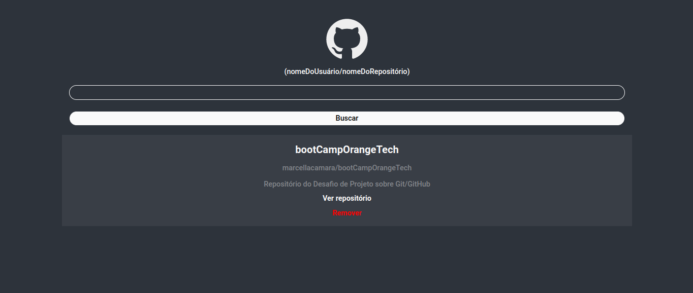

# Desafio: Wiki do GitHub com React

Wiki de repositórios do GitHub com React. Este projeto foi um dos desafios lançados no Bootcamp Orange Tech+ Inter em parceria com a Digital Innovation One.



## Como rodar o projeto:

- Clonar o repositório:

```bash
  git clone https://github.com/marcellacamara/wiki-github.git
```

- Instalar as dependências:

```bash
  npm install
  cd wiki-github
```

- Executar o projeto:

```bash
npm start
```

## Autores

- Feito com 💜 por [@marcellacamara](https://www.github.com/marcellacamara).
